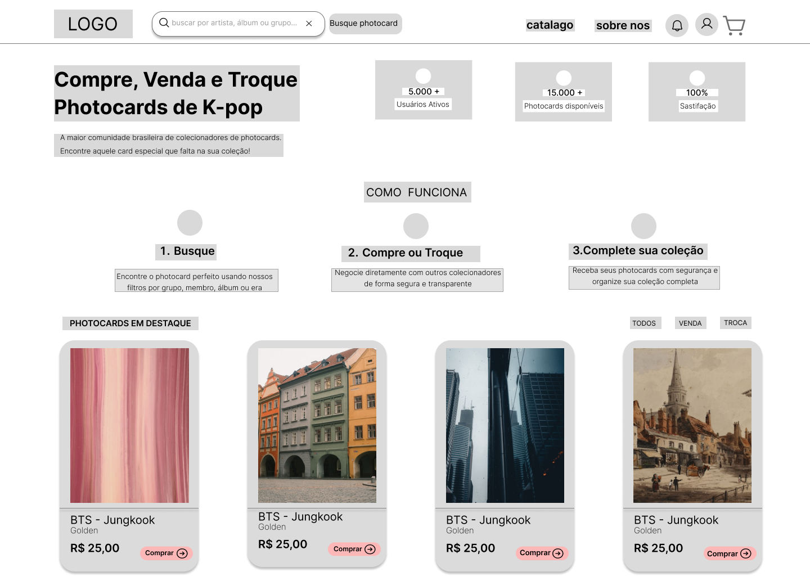

# Desafio Wireframe one page 

## 📌 Descrição
Este projeto consiste na criação de um wireframe de média fidelidade para única página (one page), escolhi o tema de site de vendas especificamente um para vendas e trocas de photocards de k-pop. Pensado para focar em um só lugar as vendas e ceg de photocards, com a ideia de deixar algo mais limpo e mais organizado para o vendendor e pro comprandor. Possivelmente continuarei a trabalhar nessa ideia.

## Objetivo
Aplicar conceitos de usabilidade, psicologia do design e heurísticas de Nielsen, aprendidos no curso de Formação UI/UX Designer da DIO.

## Descrição do Design 

### Visual

1. header com navegação
2. campo de busca já destacado
3. uma seção explicando como funciona o site
4. um destaque com os principais produtos em altas.

### Usabilidade 

1. clareza nas ações principais: busca, compra e troca
2. elementos visuais de facil reconhecimento
3. poucas opções de filtro para o usuário 

##  Funcionalidades do Wireframe

* Campo de busca por artista, álbum ou grupo
* Filtros de navegação (Todos / Venda / Troca)
* Cards de produtos com:

  * Imagem
  * Nome do artista
  * Preço
  * Botão de ação
* Seção explicativa “Como funciona”

## Ferramentas Utilizadas

* Figma (criação do wireframe)
* Git (versionamento)
* GitHub (hospedagem do projeto)

## 📷 Imagens

## 🔗 Link do protótipo
(https://www.figma.com/proto/EgTjd90sIHrLQPTBKvRcZq/Wireframes-Kit---Free-wireframing-Websites-and-SaaS-UI-UX--Community-?node-id=3124-4853&p=f&viewport=-229%2C174%2C0.35&t=gjRpl58DPnHjGE4Z-1&scaling=min-zoom&content-scaling=fixed&starting-point-node-id=3124%3A4853&page-id=1140%3A6414)

